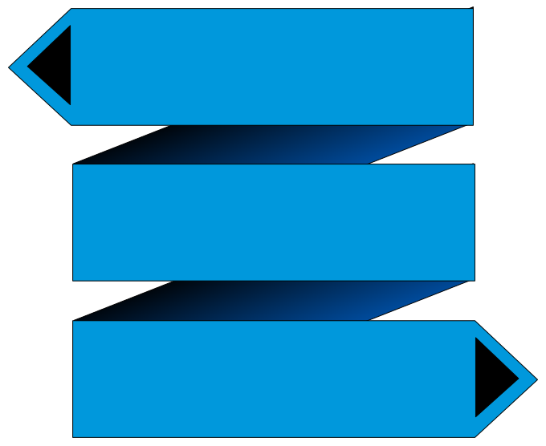

<a href="https://swiftbar4s.bilal-fazlani.com">
  
</a>

# SwiftBar4s is a scala framework to create [swiftbar](https://github.com/swiftbar/SwiftBar) plugins for MacOS


# Documentation

## https://swiftbar4s.bilal-fazlani.com

# Usage

```scala
import com.bilalfazlani.swiftbar4s.dsl.*

object SimplePlugin extends PluginDsl {
  handler {
    handle("send-email") { emailMayBe =>
      println(s"email sent to $emailMayBe")
    }

    handle("print-hello") {
      println("hello world")
    }
  }

  menu("my-plugin", color = "red,green") {
    action("send email", "send-email", Some("abc@xyz.com"), true)
    action("print hello", "print-hello", showTerminal = true)
    text("item 1", font = "Times")
    ---

    text("item 2", textSize = 15)
    subMenu("submenu"){
      text("item 3", length = 4)
      text("item 4")
      Range(5,10).foreach{ i =>
        link(s"item $i", "http://google.com")
      }
      subMenu("nested", color = "orange"){
        text("item 10")
        ---

        text("item 11")
        shellCommand("item 12", "echo", showTerminal = true ,params = "hello world", "sds")
      }
    }
  }
}
```


You can create text, web links, shell commands and plugin actions.

All the items support configurations such as color, text size, image, emojis etc.
