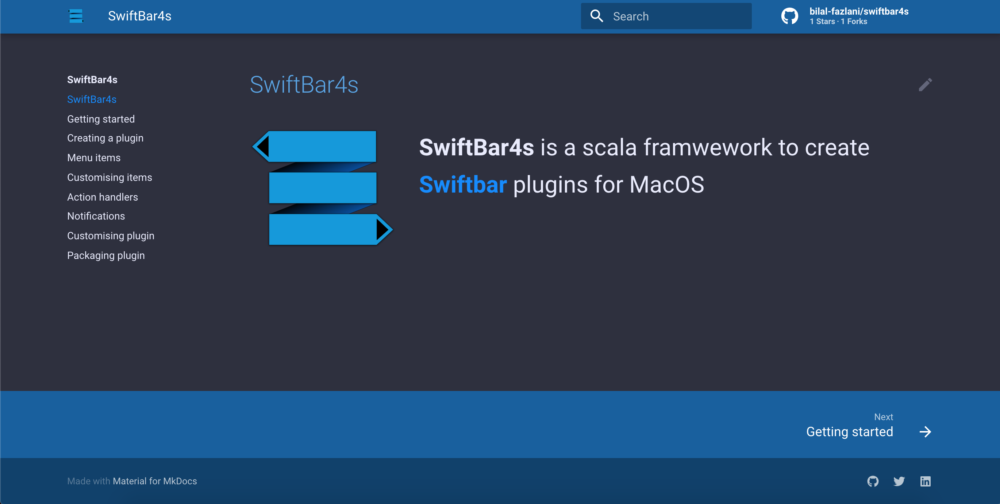
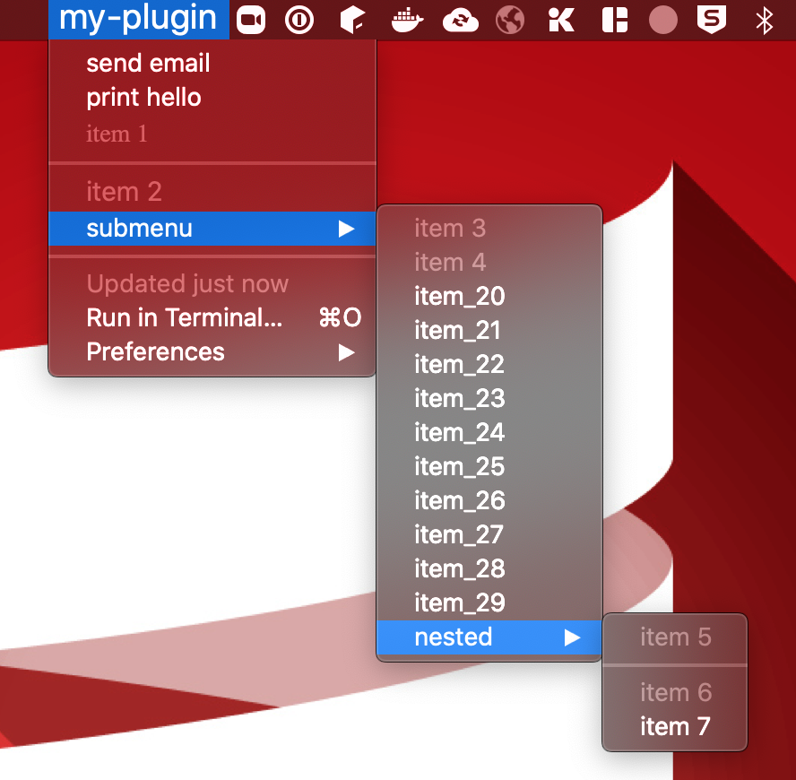

# SwiftBar4s is a scala framework to create [swiftbar](https://github.com/swiftbar/SwiftBar) plugins for MacOS


## Documentation

**https://swiftbar4s.bilal-fazlani.com**

<a href="https://swiftbar4s.bilal-fazlani.com">
  
</a>

## Usage

- create an `object` and extend from `SwiftBarApp with MenuDsl with HandlerDsl`

- create a handler for actions your plugin may dispatch. Example:

```scala
  override val handler = handler {
    handle("send-email") { emailMayBe =>
      emailMayBe.map(sendEmail)
    }

    handle("print-hello") {
      println("hello world")
    }
  }
```

- Use the dsl to create menu items either statically for dynamically. Example:

```scala
  override val appMenu = menu("my-plugin", color = "red,white", textSize = 20) {
    action("send email", "send-email", Some("abc@xyz.com"), true)
    action("print hello", "print-hello", showTerminal = true)
    text("item 1", font = "Times")
    ---
    text("item 2", textSize = 15)
    subMenu("submenu"){
      text("item 3")
      text("item 4")
      Range(20,30).foreach{ i =>
        link(s"item_$i", "http://google.com")
      }
      subMenu("nested", color = "orange"){
        text("item 5")
        ---
        text("item 6")
        shellCommand("item 7", "echo", showTerminal = true ,params = "hello world", "sds")
      }
    }
  }
```



You can create text, web links, shell commands, and plugin actions.

All the items support configuratios such as color, text size, image, emojis etc.
